# Diagrama AS-IS — Concessão de Ajuda de Custo (Terracap)

Diagrama do fluxo da Parte C, mapeando atores, sistemas, artefatos e fail points ao longo das cinco fases temporais do Service Blueprint. As setas sólidas representam fluxos formais/sistêmicos; as setas tracejadas representam fluxos manuais, informais ou de consulta.

```mermaid
flowchart TD
    %% Estilos de Nós
    classDef ator fill:#2b5c8f,stroke:#1a365d,stroke-width:2px,color:#fff;
    classDef sistema fill:#f4f5f7,stroke:#cbd5e1,stroke-width:1px,color:#334155;
    classDef fail fill:#fee2e2,stroke:#ef4444,stroke-width:2px,color:#991b1b;
    classDef artefato fill:#fef08a,stroke:#eab308,stroke-width:1px,color:#713f12;

    %% ===== ATORES =====
    Emp([Empregado / Executor]):::ator
    DT([Diretorias Técnicas / Gestão de Contratos]):::ator
    NUPAG[Analista NUPAG/GEPAG]:::ator
    AUDIT([Controladoria Interna - AUDIT]):::ator

    %% ===== SISTEMAS E ARTEFATOS =====
    Canal[(Canal de Publicação Oficial)]:::sistema
    SEI[(Sistema SEI)]:::sistema
    SisContrato[(Sistema de Gestão de Contratos)]:::sistema
    Ponto[(Sistema de Gestão de Ponto)]:::sistema
    ERP[(ERP de Folha - Cego)]:::sistema
    Portaria{{Portaria de Designação}}:::artefato
    Planilha{{Planilha Excel de Controle}}:::artefato
    PreFolha{{Consulta Prévia do Contracheque}}:::artefato
    Contracheque{{Contracheque Definitivo}}:::artefato

    %% ===== T1: GATILHO E CIÊNCIA DA DESIGNAÇÃO =====
    subgraph T1 [T1 - Gatilho e Ciencia da Designacao]
        DT -->|1. Emite e publica| Portaria
        Portaria -->|2. Publicada sem notificacao individual| Canal
        Canal -.->|3. Empregado busca por conta propria| Emp
        Emp -.->|4. Aciona retificacao de erro material| DT
        Canal -.->|Sem aviso ao RH| FP1[/FP1: Perda de prazo por falta de notificacao/]:::fail
    end

    %% ===== T2: INSTRUÇÃO E PROTOCOLO =====
    subgraph T2 [T2 - Instrucao e Protocolo do Pedido]
        Emp -->|5. Compila lista de contratos ativos| Emp
        Emp -->|6. Protocola requerimento < 30 dias| SEI
        SEI -->|7. Encaminha processo sem alerta automatico| NUPAG
        DT -.->|Comunicacao informal de aditivos/rescisoes| NUPAG
        DT -.->|Falha de comunicacao| FP4[/FP4: Ruptura entre Diretorias e NUPAG/]:::fail
    end

    %% ===== T3: PROCESSAMENTO E ANÁLISE (BACKSTAGE-HEAVY) =====
    subgraph T3 [T3 - Processamento e Analise Backstage]
        NUPAG -->|8. Triagem documental| SEI
        NUPAG -.->|9. Diligencia se faltar documento| SEI
        SEI -.->|10. Notifica diligencia| Emp
        NUPAG -.->|11. Consulta valor e vigencia| SisContrato
        NUPAG -.->|12. Aplica trava do 4o contrato e teto| Planilha
        Planilha -.->|Sem gatilho de baixa de contrato| FP2[/FP2: Erro na contagem de carencia/]:::fail
        Ponto -.->|13. Fornece dias de afastamento| NUPAG
        NUPAG -.->|14. Calcula proporcionalidade manual| Planilha
        Planilha -.->|Calculo manual sem suporte| FP3[/FP3: Erro no calculo proporcional/]:::fail
    end

    %% ===== T4: HOMOLOGAÇÃO E PRÉ-FOLHA =====
    subgraph T4 [T4 - Homologacao e Pre-folha]
        NUPAG -->|15. Lanca verba avulsa manualmente| ERP
        ERP -->|16. Gera fotografia da competencia| PreFolha
        PreFolha -->|17. Janela visual de conferencia| Emp
        Emp -.->|18. Reclama subpagamento| NUPAG
        Emp -.->|Silencia superpagamento| FP6[/FP6: Homologacao assimetrica - Erario desprotegido/]:::fail
    end

    %% ===== T5: FECHAMENTO E CRÉDITO =====
    subgraph T5 [T5 - Fechamento e Credito]
        NUPAG -->|19. Consolida e fecha folha| ERP
        ERP -->|20. Emite contracheque| Contracheque
        Contracheque -->|21. Credito na conta| Emp
        Emp -.->|22. Duvida residual| NUPAG
        NUPAG -.->|23. Abre planilha no atendimento| Planilha
        NUPAG -.->|Conhecimento concentrado no analista| FP5[/FP5: Dependencia de pessoa-chave/]:::fail
    end

    %% ===== CAMADA DE CONTROLE (AUDIT) =====
    AUDIT -.->|Audita conformidade da folha| ERP
    AUDIT -.->|Exige evidencias de teto e carencia| Planilha
    Planilha -.->|Solucao de Contorno Estrutural: prestacao de contas| AUDIT
```

## Leitura do diagrama
- **Atores (azul):** Empregado, Diretorias Técnicas, Analista NUPAG/GEPAG e Controladoria Interna (AUDIT).
- **Sistemas (cinza):** Canal de Publicação, SEI, Sistema de Contratos, Gestão de Ponto e ERP de Folha — **nenhum integrado ao ERP**, o que força as consultas manuais tracejadas.
- **Artefatos (amarelo):** Portaria, Planilha de Controle, Consulta Prévia e Contracheque.
- **Fail Points (vermelho):** FP1 a FP6, ancorados na fase em que ocorrem.
- As setas **tracejadas** revelam o cerne do diagnóstico: quase toda a operação crítica (consultas, travas, cálculo, comunicação de aditivos e prestação de contas à AUDIT) acontece por vias **manuais ou informais**, não sistêmicas — exatamente onde os fail points se concentram.
